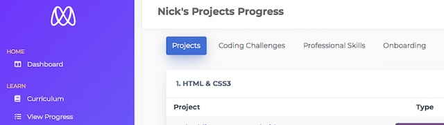
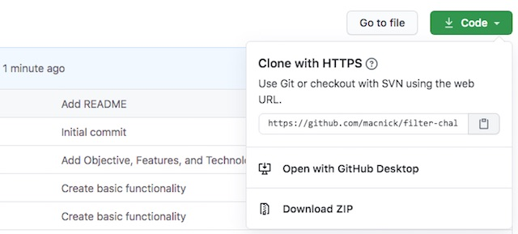
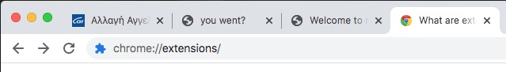
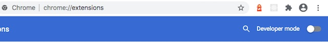
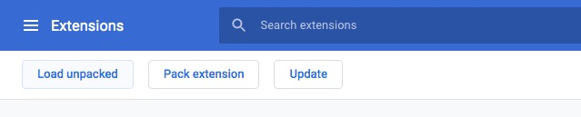
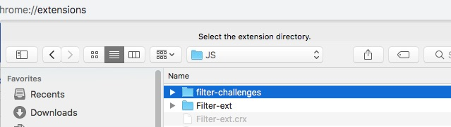
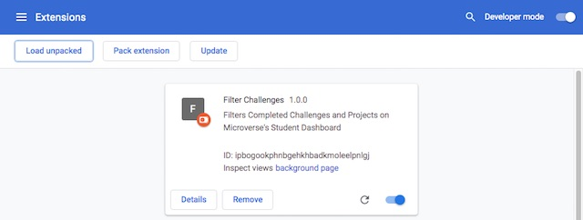
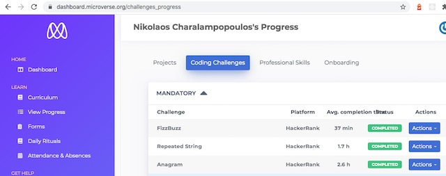
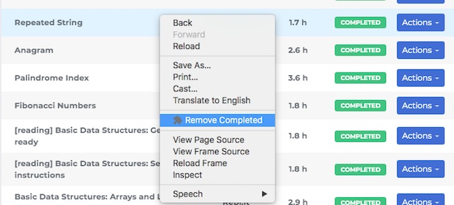

# Filter Challenges

Chrome extension made for the Microverse online software school students.

## Table of Contents

- [Objective](#Objective)
- [Features](#Features)
- [Future Features](#Future-Features)
- [Installation](#Installation)
- [Usage](#Usage)
- [Technologies Used](#Technologies-Used)
- [Acknowledgments](#Acknowledgments)
- [Author](#Author)
- [Contributing](#Contributing)
- [Show your support](#Show-your-support)

### Objective

[Microverse](https://www.microverse.org) is an online software development school. Students learn multiple programming languages and Computer Science fundamentals, through working on real projects with other students to reach mastery. Every day, each student, her/his coding partner, and the stand-up team will support and hold each other accountable to produce great work while remote pair programming.

There is a dashboard where the students can connect and get info for their weekly progress and the daily program. On the dashboard, there is an option called 'View Progress'. By clicking on it, the students see a page with options to choose between Projects, Coding Challenges, and Professional skills.



When students click on an option they see a list of their projects. The problem is that after a couple of months the list has many completed projects and they have to scroll a lot. This is especially true in the case of Coding Challenges. This extension solves this problem by removing temporarily the completed projects.

[Up](#Table-of-Contents)

### Features

1. It temporarily removes all completed projects from the list. User can see the full list by reloading the page. Currently works on Coding Challenges, and Professional skills. 

### Future Features

1. Add an icon
2. Make it work on the Projects list.

### Installation

Currently the extension in not on the Coogle Store. Follow the steps below to add it to your Chrome.

1. Clone this repo to your computer.



2. On your Chrome bar type ```chrome://extensions/``` and press enter.



3. Turn on the Developer mode toggle button on the top right of the bar.



4. Click the Load Unpacked button.


5. Navigate where you saved the project and select the filter-challenges folder.



6. If you did everything right the extension is installed and ready to use.



[Up](#Table-of-Contents)

### Usage

1. Navigate to your Microverse Dashboard. Click View Progress and then Coding Challenges. 



2. Right-click anywhere on the list. (or two finger tap if you are on a Laptop). In the popup menu select Remove Completed



3. Enjoy your new pending only items list!

[Up](#Table-of-Contents)

### Technologies Used

- HTML/CSS
- ES6
- Chrome

[Up](#Table-of-Contents)

## Acknowledgements

- [Microverse](https://www.microverse.org) software development school
- [Murilo Roque Paiva da Silva](https://github.com/MuriloRoque) for fixing the Projects list

[Up](#Table-of-Contents)

## 👤 Author

- Github: [@macnick](https://github.com/macnick)
- Twitter: [@mac_experts](https://twitter.com/mac_experts)
- Linkedin: [Nick Haralampopoulos](https://www.linkedin.com/in/nick-haralampopoulos/)
- AngelList: [Nick Haralampopoulos](https://angel.co/u/nick-haralampopoulos)

## 🤝 Contributing

Contributions, issues and feature requests are welcome!

Feel free to check the [issues page](https://github.com/macnick/react-calculator/issues).

1. Fork it (https://github.com/macnick/react-calculator/fork)
2. Create your feature branch (git checkout -b my-new-feature)
3. Commit your changes (git commit -am 'Add some feature')
4. Push to the branch (git push origin my-new-feature)
5. Create a new Pull Request

## Show your support

Give a ⭐️ if you enjoyed this project!

## 📝 License

This project is [MIT](lic.url) licensed.
